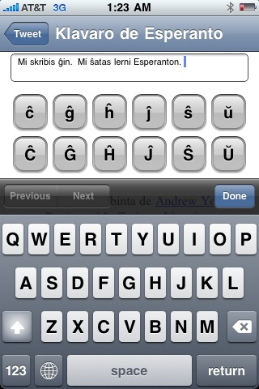

Today I wrote <a href="http://vaelen.org/klavaro/" target="_blank">a simple Esperanto keyboard for the iPhone</a>. It's really just a little HTML page with some JavaScript and CSS to make it look like an iPhone app when you view it from an iPhone. It looks pretty bad if you view it outside of an iPhone though, because the buttons don't line up right. Maybe I'll make it more fully featured on non-iPhone browsers, but there are better tools out there for that already.
