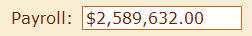
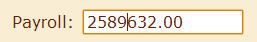
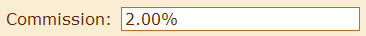
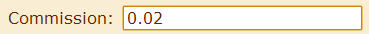

[Dijit]((http://dojotoolkit.org/widgets) is a web UI toolkit built on top of the [Dojo framework](http://dojotoolkit.org/).
One of its widgets is called [NumberTextBox]((http://dojotoolkit.org/reference-guide/dijit/form/NumberTextBox.html).
This widget allows you to show and edit formatted numbers easily.

For example, I can create an instance of [CurrencyTextBox](http://dojotoolkit.org/reference-guide/dijit/form/CurrencyTextBox.html) (a subclass of NumberTextBox) and call `set("value", 2589632)`.
This will display the value as follows (assuming that my locale is set to en_US):



If I click in the box to edit the value, it changes back to just numbers and looks like this:



Exiting the field will reformat the displayed value to match my locale's number formatting guidelines.
However, when I call the get("value") method on the widget, I will get back the number 2589632 instead of the formatted string.
This makes it easily to implement locale sensitive number formatting for web applications.

The problem I've been having is that percents aren't handled quite right.
Setting the `type` constraint to `percent` will properly display percent values so that setting the value of the widget to `0.02` will display the string `2.00%`.



However, When the user clicks on the box to edit the value, the `2.00%` is replaced by it's real value: `0.02`.



This causes two problems:
1. The user is expecting to enter a percentage, not a decimal value.
   Users are often confused when the value they were expecting to see suddenly changes.
   Also, a user might enter `2` in the field, expecting it to show `2.00%`.
   Instead it will show `200.00%`.
2. Truncation can occur when the number being edited has too many decimal places.
   Setting the `places` constraint on the widget to `2` will display the value `0.0256` as `2.56%`.
   However, when you edit the value it truncates back to 2 decimal places, showing you only "0.02".
   Those extra two decimal places are now lost forever.

There is an [open defect](http://bugs.dojotoolkit.org/ticket/10582) for this issue, but I couldn't wait for them to fix it in the main dojo code.
To get around these issues I started digging into the NumberTextBox code and found that I can replace the `parse()` method on the NumberTextBox object to get around the problem.
This solution also appends a percent symbol to the end of the string if one was left off, making it easier for a user to simply enter `10` and have that converted to `10.00%` when they move to the next field.

Here is my solution:

``` javascript
function createPercentTextBox(name, title, extraParams) {
    if(!dojo.isObject(extraParams)) {
        extraParams = {};
    }

    var parseFunction = function(expression, options) {
        if(dojo.isString(expression)) {
            expression = dojo.trim(expression);
            var i = expression.lastIndexOf("%");
            if(i == -1) {
                expression = expression + "%";
            }
        }
        var value = dojo.number.parse(expression, { pattern: '0%' });
        return value;
    };

    var params = {
        id: name,
        name: name,
        label: title ? title + ":" : "",
        title: title ? title : "",
        constraints: {
            type: 'percent',
            places: 2
        },
        editOptions: {
            pattern: "##0.00%"
        },
        parse: parseFunction
    };

    dojo.mixin(params, extraParams);

    return new dijit.form.NumberTextBox(params);
}

```

Note: I'm using [Dojo 1.6](http://dojotoolkit.org/api/1.6/) for this example. Future versions of Dojo may resolve this issue more elegantly.
