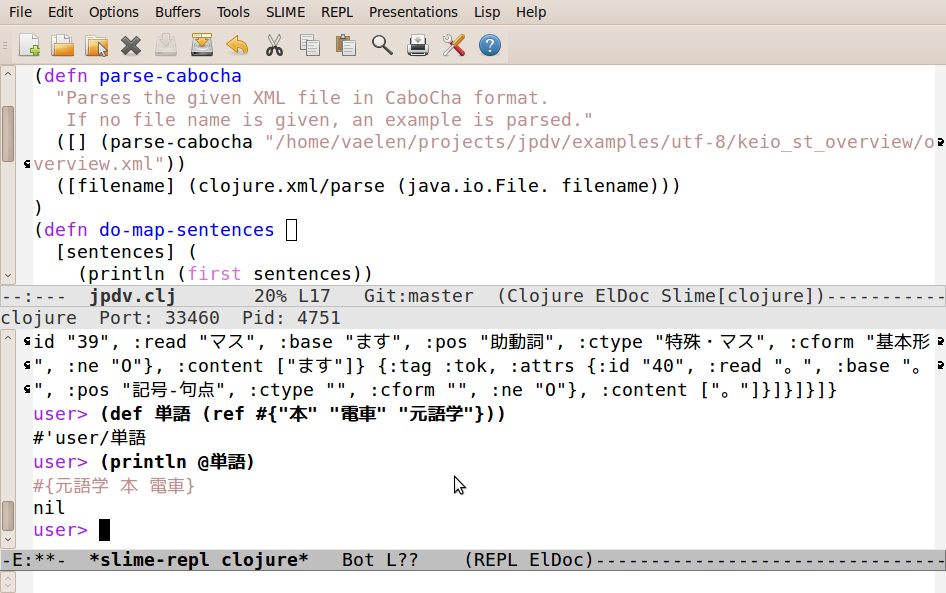

This might be proof that I'm crazy:

I'm working on a <a href="http://github.com/vaelen/jpdv">project</a> for my NLP class that involves generating a <a href="http://en.wikipedia.org/wiki/Vector_space_model" target="_blank">semantic vector space</a> for Japanese text, and I decided that this might be a good time to learn one of the LISP dialects.  I've been looking at <a href="http://clojure.org/" target="_blank">Clojure</a> for a while now, but I hadn't taken the time to learn it before.  I must say, I'm quite impressed so far.  The fact that reading a Japanese XML document into a data structure "just works" without any tweaking is pretty nice.  I'm still coming to grips with functional programming, but I'm liking it so far.  And the best thing as far as I'm concerned is that Clojure code can easily be made <a href="http://clojure.org/concurrent_programming" target="_blank">massively parallel</a> thanks to all of its data types being immutable (ala Erlang).  That will help me out a lot when I need to run my code on multi-core / multi-processor machines (which I often have to do because of the sheer amount of data being crunched.)
