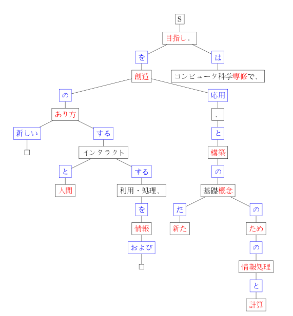

I've been working on a new project I call "Japanese Dependency Vectors" or "<a href="http://github.com/vaelen/jpdv" target="_blank">jpdv</a>" for short.  It's a program that generates <a href="http://en.wikipedia.org/wiki/Dependency_grammar" target="_blank">dependency</a> based semantic <a href="http://en.wikipedia.org/wiki/Vector_space_model" target="_blank">vector spaces</a> for Japanese text.  (There's already an excellent <a href="http://www.nlpado.de/~sebastian/dv.html" target="_blank">tool</a> for doing this with English, which was written by <a href="http://www.nlpado.de/~sebastian/software.html" target="_blank">Sebastian Pado</a>.)

However, jpdv still has a way to go before it works as promised.  So far the tool can parse <a href="http://chasen.org/~taku/software/cabocha/" target="_blank">CaboCha</a> formatted XML and produce both a word co-occurrence based vector space and a slightly modified XML representation that better demonstrates the dependency relationships of the words in the text.  The next step is to use the dependency information to produce the vector space that I need.  Unfortunately, I only have until the end of next week to finish it, because I'm working on this as the final project in my NLP class this semester.  I also plan to use the vector spaces created by the tool to do word sense disambiguation for the <a href="http://semeval2.fbk.eu/" target="_blank">SEMEVAL-2</a> shared task on <a href="http://lr-www.pi.titech.ac.jp/wsd.html" target="_blank">Japanese WSD</a>.

(The image included here was generated by jpdv as a LaTeX file from one of the sentences I'm using for testing.)
