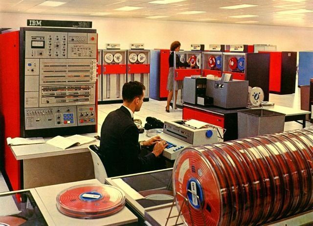

All the recent interest in COBOL due to its use in large
financial systems is fascinating. Just because a language is old
doesn't mean it is useless or that people aren't using it to engineer
important systems.

I have fond childhood memories of going to the local university with
my mom when she would work on her COBOL programs for school. She
would sit at a 3270 terminal in a computer lab typing away and when
she was done she would print out her code on 132 column green and
white paper to be turned in. Despite not having studied computer
science she was able to create well designed programs in COBOL. This
was one of the design goals of COBOL. Due in part to its verbosity,
COBOL is easy to understand with a relatively small amount of
training. It is designed specifically for use in business
applications and has features that focus on data storage and
retrieval, report generation, and the kind of math that is commonly
used in accounting applications. When it was created in the 1960s, it
filled a important niche in the landscape of existing programming
languages. Assembler was used for systems programming, FORTRAN for
scientific and math heavy computing, LISP for academic and research
computing, but nothing was targeted specifically at the growing
business market. The 1970s would see a rise in more general purpose
programming languages like C and Pascal, but COBOL would remain a
mainstay of business programming for many years.

In 2015 I was working for an insurance company that was modernizing
its IT infrastructure. The claims processing system ran on an OpenVMS
server and was written in a combination of COBOL and BASIC. I already
knew BASIC, having learned it in elementary school on the Apple IIe
and early PCs, but I thought I should learn at least some COBOL so
that I could have a better understanding of the system I was
maintaining. A few months later my knowledge came in handy when we
received an interface file definition from one of the large insurance
companies in the form of a COBOL data definition. Since then I've
played with COBOL a bit and have posted some toy programs to
[GitHub](https://github.com/vaelen/cobol).

Should COBOL be replaced? The initial response by many, as highlighted
in the media, is that COBOL is an ancient language and should
therefore be replaced. But it's important to remember that the age of
a programming language is not the only metric we use when deciding
whether or not we should use it. Windows, Linux, and MacOS are written
largely in C even though it's 50 years old. Other systems, like Emacs
and Grammarly for example, are written in LISP, a 60 year old language
that was around when COBOL was first released. Of course, in both
these cases the language as it is currently used is different from the
version that was initially released all those years ago. There have
been major advances in software engineering since the 1960s, and like
other popular languages of its day COBOL was updated to take advantage
of these changes for a while. However, the speed of these
improvements slowed over time and in the past two decades COBOL hasn't
kept up well with changes in technology. This may be a good reason to
replace systems written in COBOL with more modern alternatives. You
aren't going to be able to easily write an application that scales to
millions of requests per day in COBOL as it is today. On the other
hand, COBOL does what it was designed to do very well and it is well
tested and robust. So why hasn't it kept up with the times?

I think the reason for this is largely due to the shift in the last
two decades away from commercial programming languages and towards
open source alternatives. When I first started learning C in school I
used the Borland Turbo C compiler and IDE. The need to purchase a
compiler and IDE meant that anyone who wanted to learn a programming
language had to make an up-front financial commitment to do so. The
fact that BASIC came preinstalled on most personal computers in the
80s and 90s is one of the reasons why it was so popular: the barrier
to entry was low. In contrast, COBOL -- being targeted towards
large businesses -- required a financial commitment to learn. My
mother, after all, had to use an IBM mainframe owned by the university
to learn it. The COBOL ecosystem was mostly, if not entirely,
commercial with no real open source libraries to speak of. As more
beginning programmers began to use open source tools that were freely
available, fewer new programmers learned COBOL. Universities that had
taught it as a type of business programming moved to other languages
like Java that were freely available and had large open source
ecosystems. Over time this created a lack of qualified engineers to
maintain and update older systems written in COBOL.

The [GnuCobol project](https://open-cobol.sourceforge.io/) set out
to fix this by creating an open source
implementation of COBOL that can run on commodity hardware. They've
done a great job, and I suggest you download their compiler and give
COBOL a try some time. There are lots of books available to help you
learn COBOL, and the GnuCobol Programmer's Guide available on the
project's website might be a good place to start for experienced
programmers. There are also online courses availble from IBM and others.
[Cloudflare even used GnuCobol to add support for COBOL to its
platform.](https://blog.cloudflare.com/cloudflare-workers-now-support-cobol/)
Even if COBOL never regains the popularity it once had, there will
likely still be applications written in it for years to come.
