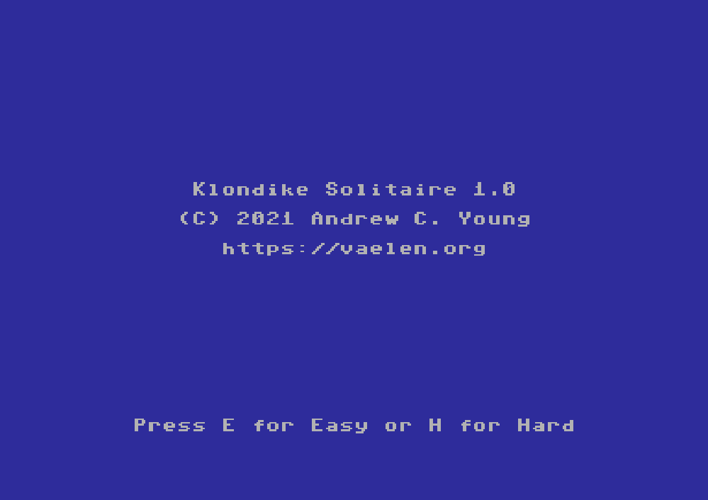

Klondike Solitaire is an implementation of the
[famous solitaire card game](https://en.wikipedia.org/wiki/Klondike_(solitaire))
for the Commodore 64 written in 6502 assembly.
It currently only supports text mode, but I plan to add support for better
graphics in a future release.
I am also considering porting it to the new Commander X-16 system.

I wrote Klondike Solitaire primarily as an intermediate introduction to 6502
assembler, but it is quite playable and enjoyable.

You can choose to play in easy
mode (where one card is drawn from the deck each time) or hard mode
(where three cards are drawn each time).

Cards are moved by first selecting a source (`D` for the deck or a number
from `1` - `7` for a stack) and then a destination (`P` for the piles or
`1` - `7` for the stacks.)
Stacks of cards can be moved all at once when one of the cards
in the stack matches the destination card.
Pressing `C` will draw another card from the deck.

If you would like to try it out, the current version can be downloaded here:

<a href="sol.prg"> sol.prg</a>

If you enjoy the game, please consider [buying me a coffee](https://ko-fi.com/andrewyoung).
